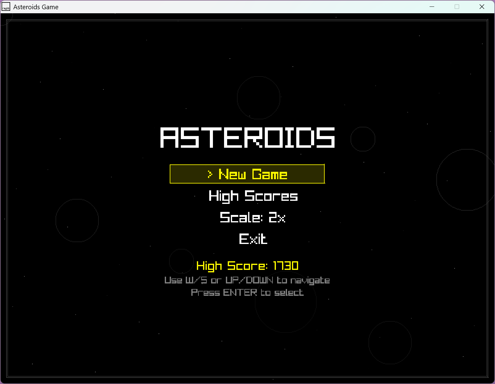

# Asteroids - Classic Arcade Game Recreation
## 🚀 **V1.0 RELEASE** - Professional-Quality Game Complete!

A modern recreation of the classic Asteroids arcade game, built in C++ with Raylib. Features professional-quality audio, particle effects, high score persistence, pause functionality, and polished gameplay while maintaining the authentic retro feel.

## 🤖 **AI-Assisted Learning Project**

> **⚠️ IMPORTANT DISCLOSURE:** This project was created **primarily using GitHub Copilot Agent mode** as a learning exercise in game development, C++ programming, and AI-assisted coding. While I (the repository owner) made design decisions, provided feedback, and performed some manual tweaks, **the vast majority of the source code was generated by AI**.
>
> **This is NOT presented as hand-written code** - it's a demonstration of:
> - AI-assisted game development workflows
> - Learning C++ and game programming concepts through AI collaboration
> - Exploring what's possible with modern AI coding tools
> - Understanding game architecture through guided AI development
>
> If you're looking for examples of traditional hand-coded games, this repository may not be suitable. However, if you're interested in AI-assisted development processes or learning game programming concepts, this project demonstrates effective human-AI collaboration in software development.

## 🎮 Screenshot


*Classic Asteroids action with modern particle effects and starfield background*

## 🚀 Features

### Core Gameplay
- **Classic Asteroids Experience** - Authentic ship physics, asteroid behavior, and wave progression
- **Enhanced Controls** - WASD or Arrow keys for movement, with reverse thrust/braking support
- **Natural Physics** - Realistic momentum and inertia-based ship movement
- **Progressive Difficulty** - Waves increase in asteroid count and complexity
- **Lives System** - 4 lives with visual ship icons in HUD

### Audio & Visual Polish
- **Procedural Audio System** - No external audio files required
  - Shooting sounds, explosion effects, thrust audio, game over music
- **Particle Effects System** - Dynamic visual feedback
  - Asteroid explosions, ship destruction, thrust trails
- **Animated UI** - Starfield backgrounds, enhanced menus, wave transitions
- **Professional HUD** - Clean display with score, lives, and wave information

### V1.0 Features
- **High Score System** - Persistent high score tracking with file I/O
  - Automatic save/load from `highscore.dat`
  - Display on main menu and dedicated High Scores screen
  - "NEW HIGH SCORE!" notification when achieved
- **Advanced Pause System** - Professional pause functionality
  - P key for quick pause/resume during gameplay
  - Dynamic context-aware pause menus (Continue/Main Menu)
  - Professional pause overlay with visual effects
- **Safety Spawn System** - Visual feedback and safe respawn mechanics
- **Enhanced Menu System** - Resume functionality, scaling options, visual highlights
- **Smooth State Management** - Seamless transitions between game states
- **Professional Documentation** - Comprehensive Doxygen-style function documentation

## 🎮 Controls

| Action | Keys |
|--------|------|
| **Rotate Left** | A or ← |
| **Rotate Right** | D or → |
| **Thrust Forward** | W or ↑ |
| **Reverse/Brake** | S or ↓ |
| **Shoot** | Space |
| **Menu Navigation** | W/S or ↑/↓ |
| **Select** | Enter or Space |
| **Pause/Resume** | P (during gameplay) |
| **Return to Menu** | ESC (during gameplay) |
| **Exit Game** | Select "Exit" from menu |

## 🛠️ Technical Details

### Architecture
- **Modular Design** - Clean 8-file C++ architecture
- **Separation of Concerns** - Physics, rendering, audio, and game logic separated
- **Memory Safe** - RAII patterns, automatic cleanup, no memory leaks
- **Performance Optimized** - Smooth 60 FPS with efficient rendering

### File Structure
```
src/
├── main.cpp          # Main game loop and state management
├── physics.cpp       # Ship movement and input handling
├── game_logic.cpp    # Collision detection and game mechanics
├── menu_system.cpp   # Menu system with visual effects
├── rendering.cpp     # HUD, backgrounds, and utilities
├── audio.cpp         # Complete procedural audio system
├── particles.cpp     # Particle effects system
└── common.h          # Shared structures and declarations
```

### Dependencies
- **Raylib 5.0+** - Cross-platform game development library
- **C++14 or later** - Modern C++ features
- **No external assets** - All audio and effects generated procedurally

## 🏗️ Building

### Requirements
- C++ compiler with C++14 support
- Raylib 5.0 or later
- Make (or compatible build system)

### Build Instructions
```bash
# Debug build
make RAYLIB_PATH=/path/to/raylib PROJECT_NAME=asteroids OBJS=src/*.cpp BUILD_MODE=DEBUG

# Release build  
make RAYLIB_PATH=/path/to/raylib PROJECT_NAME=asteroids OBJS=src/*.cpp
```

### Windows (with w64devkit)
```bash
mingw32-make RAYLIB_PATH=C:/raylib/raylib PROJECT_NAME=asteroids OBJS=src/*.cpp
```

## 🎯 Roadmap

### V1.0 (Current)
- [ ] High score persistence system
- [ ] Pause overlay functionality
- [x] All core gameplay features
- [x] Complete audio system
- [x] Particle effects
- [x] Enhanced UI/UX

### V1.1+ (Future)
- Controls help screen
- Additional polish and refinements

## 🏆 Development Philosophy & Learning Approach

This AI-assisted project demonstrates:
- **Human-AI Collaboration** - Strategic decisions by human, implementation by AI
- **Iterative Development** - Continuous feedback and refinement cycles
- **Learning Through Guidance** - Understanding concepts through AI-generated examples
- **Quality Through AI** - Leveraging AI for professional-grade code structure

### Traditional Development Values Maintained:
- **Authentic retro experience** with modern polish
- **Clean, maintainable code** architecture  
- **Performance and stability** over feature bloat
- **Professional quality** with attention to detail

### AI Development Process:
1. **Human defines requirements** and provides feedback
2. **AI implements features** with proper architecture
3. **Human tests and refines** through iterative feedback
4. **AI handles technical details** while human guides direction

## 📝 License

[Add your chosen license here]

## 🤝 Contributing

[Add contribution guidelines if you want community involvement]

---

## 🎓 Learning Outcomes & AI Collaboration

This project served as an educational exploration of:
- **Game Development Fundamentals** - Physics, collision detection, state management
- **C++ Architecture Patterns** - Modular design, RAII, memory management
- **AI-Assisted Programming** - Effective prompting, iterative refinement, human oversight
- **Professional Development Practices** - Documentation, testing, version control

### What I Learned:
- Game loop architecture and state management
- Physics simulation and collision systems
- Audio programming and procedural generation
- Particle systems and visual effects
- The power and limitations of AI coding assistance

### AI Contribution:
- ~95% of source code implementation
- Architecture design and file organization
- Technical problem solving and optimization
- Documentation and code comments

### Human Contribution:
- Project vision and requirements definition
- Design decisions and feature prioritization
- Testing, feedback, and quality assurance
- Repository setup and project management

---

**Created through Human-AI Collaboration using GitHub Copilot Agent Mode**
*C++ • Raylib • AI-Assisted Development*

*An exploration of AI-powered game development for learning purposes*

---
*Built as a learning project following classic Asteroids mechanics*